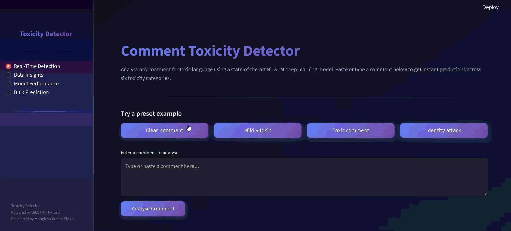
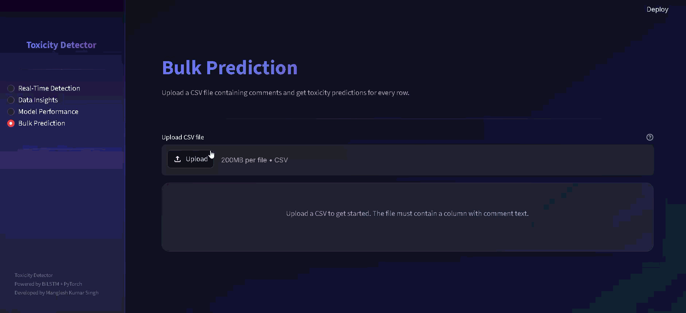

# Deep Learning for Comment Toxicity Detection


> A production-ready deep learning application that detects toxic comments in real time using a Bidirectional LSTM neural network, powered by an interactive Streamlit web dashboard.

---

## Table of Contents

- [Overview](#overview)
- [Project Structure](#project-structure)
- [Dataset](#dataset)
- [Getting Started](#getting-started)
  - [Prerequisites](#prerequisites)
  - [Installation](#installation)
  - [Dataset Setup](#dataset-setup)
  - [Training (Google Colab)](#training-google-colab)
  - [Running the App](#running-the-app)
- [Model Architecture](#model-architecture)
- [Usage](#usage)
- [Tech Stack](#tech-stack)
- [Model Performance](#model-performance)
- [Business Use Cases](#business-use-cases)
- [Contributing](#contributing)
- [License](#license)
- [Acknowledgments](#acknowledgments)

---

## Problem Statement

Online communities and social media platforms are integral to modern communication, but the prevalence of toxic comments (harassment, hate speech, offensive language) severely impacts healthy discourse. To maintain constructive environments, automated real-time systems are needed to detect and flag toxicity at scale.

The objective of this project is to build a deep learning-based comment toxicity model in Python. The model analyzes online comments and predicts toxicity probabilities, assisting platform moderators in mitigating negative behavior through proactive filtering, warnings, or review processes.

## Overview

This project implements a **Bidirectional LSTM (BiLSTM)** deep learning model trained on the Toxic Comment Classification dataset to perform **multi-label toxicity classification** across six categories. The trained model is served through an **interactive Streamlit web application** that supports real-time single-comment analysis, bulk CSV prediction, and comprehensive model performance visualization — providing a complete, end-to-end solution for comment toxicity detection.

---

## Project Structure

```
Comment Toxicity Detection/
├── data/
│   ├── train.csv                  # Training dataset (~560K comments)
│   └── test.csv                   # Test dataset
├── demo/
│   ├── realtime.gif               # Real-time prediction demo
│   └── bulk.gif                   # Bulk prediction demo
├── src/
│   ├── __init__.py                # Package initializer
│   ├── config.py                  # Hyperparameters & configuration
│   ├── data_preprocessing.py      # Text cleaning, tokenization, vocabulary
│   ├── model.py                   # BiLSTM model architecture
│   ├── train.py                   # Training loop and checkpointing
│   ├── evaluate.py                # Evaluation metrics and visualization
│   ├── predict.py                 # Inference utilities
│   └── threshold_tuner.py         # Per-label threshold optimization
├── models/
│   ├── toxicity_model.pth         # Trained model weights
│   ├── vocab.json                 # Vocabulary mapping
│   └── training_history.json      # Training/validation loss & metrics
├── app.py                         # Streamlit web application
├── datainsight.py                 # Data insight generation utilities
├── bulk_comments.csv              # Example bulk CSV for testing
├── requirements.txt               # Python dependencies
├── README.md                      # Project documentation (this file)
└── .gitignore                     # Git ignore rules
```

---

## Dataset

This project uses the ** Toxic Comment Classification Challenge** dataset.

- **Size:** ~560,000 comments from Wikipedia Talk pages
- **Labels:** 6 binary labels (a comment can have multiple labels simultaneously)

| Label           | Description                                              |
|-----------------|----------------------------------------------------------|
| `toxic`         | General toxicity — rude, disrespectful, or unreasonable  |
| `severe_toxic`  | Highly toxic — extremely hateful or aggressive           |
| `obscene`       | Contains obscene or vulgar language                      |
| `threat`        | Contains threats of violence or harm                     |
| `insult`        | Insulting, demeaning, or belittling language              |
| `identity_hate` | Hatred targeting a specific identity group               |

> **Note:** The dataset exhibits significant class imbalance — the majority of comments are non-toxic, and categories like `threat` and `identity_hate` are relatively rare.

---

## Getting Started

### Prerequisites

- **Python 3.10+** — [Download Python](https://www.python.org/downloads/)
- **pip** — Python package installer (included with Python)
- **Git** — [Download Git](https://git-scm.com/)

### Installation

```bash
# Clone the repository
git clone https://github.com/10Unknownboy/comment-toxicity-detection.git
cd comment-toxicity-detection

# Create a virtual environment
python -m venv env

# Activate the virtual environment
env\Scripts\activate        # Windows
# source env/bin/activate   # macOS/Linux

# Install dependencies
pip install -r requirements.txt
```

### Dataset Setup

The training data (`data/train.csv` and `data/test.csv`) is included in the repository. No separate download is required — simply clone the repo and you're ready to go.

### Training (Google Colab — Recommended)

Training the model on Google Colab is recommended for free GPU access. Since the dataset is included in the repo, you just need to clone and run:

1. **Open a new Colab notebook** and run these cells:

   ```python
   # Cell 1: Clone the repository
   !git clone https://github.com/10Unknownboy/Comment-Toxicity-Detection.git
   %cd Comment-Toxicity-Detection
   ```

   ```python
   # Cell 2: Install dependencies
   !pip install torch pandas numpy scikit-learn matplotlib tqdm
   ```

   ```python
   # Cell 3: Train the model (uses GPU automatically if available)
   !python -m src.train --epochs 5 --batch-size 256
   ```

   > Tip: Use `--sample-size 160000` for faster training (~15 min on Colab GPU), or `--sample-size 0` for the full 560K dataset (~45 min).

2. **Download the trained model files** from Colab's `models/` folder:

   ```python
   # Cell 4: Zip model artifacts for easy download
   !zip -r models.zip models/
   ```
   Then click the file icon in the Colab sidebar → navigate to `models.zip` → download.

3. **Place the downloaded files** into your local `models/` directory:
   - `toxicity_model.pth` — trained model weights
   - `vocab.json` — vocabulary mapping
   - `training_history.json` — training/validation metrics
   - `evaluation_results.json` — evaluation metrics
   - `thresholds.json` — per-label decision thresholds
   - `*.png` — training visualization plots

### Running the App

Once the trained model files are in the `models/` directory:

```bash
streamlit run app.py
```

The app will launch in your browser at `http://localhost:8501`.

---

## Model Architecture

The model uses a **Bidirectional Long Short-Term Memory (BiLSTM)** architecture, which processes text sequences in both forward and backward directions to capture rich contextual information. This is particularly effective for understanding the nuanced semantics of toxic language.

### Architecture Pipeline

```
Input Text
    → Tokenization (word-level, max 200 tokens)
    → Embedding Layer (128-dimensional, learnable)
    → Bidirectional LSTM (2 layers, 128 hidden units per direction)
    → Dropout (0.3)
    → Fully Connected (256 → 64 → 6)
    → Sigmoid Activation
    → 6 Toxicity Probabilities
```

### Key Design Choices

- **Embedding Dimension (128):** Balances representational power with training efficiency.
- **Bidirectional LSTM:** Captures context from both preceding and following words, critical for understanding negation, sarcasm, and complex sentence structures.
- **2 LSTM Layers:** Enables hierarchical feature learning — lower layers capture surface-level patterns, upper layers learn abstract semantic features.
- **Dropout (0.3):** Prevents overfitting, especially important given the class imbalance in the dataset.
- **BCEWithLogitsLoss + pos_weight:** Handles severe class imbalance (e.g. `threat` at 1:430 ratio) by weighting rare positive examples more heavily during training.
- **Per-label decision thresholds:** Instead of a universal 0.5 cutoff, optimal thresholds are tuned per label on the validation set by maximising F1 score.

### Class Imbalance Handling

The dataset is heavily imbalanced — `threat` has only ~0.3% positive samples. The pipeline addresses this with:

1. **Weighted BCE Loss** — `pos_weight` per label calculated as `neg_count / pos_count`, giving rare classes proportionally higher loss.
2. **Threshold Tuning** — After training, `src/threshold_tuner.py` sweeps thresholds 0.05–0.95 per label and selects the value that maximises F1 on the validation set. Results are saved to `models/thresholds.json`.
3. **Per-label thresholds in inference** — `predict.py` and `app.py` load `thresholds.json` and apply label-specific cutoffs.

---

## Usage

### Real-Time Prediction

Experience instant toxicity detection with a premium, glassmorphism interface.

<div align="center">
  
</div>

1. Navigate to the **"Real-Time Prediction"** tab in the Streamlit app.
2. Type or paste a comment into the text input field, or click on a preset example button.
3. Click **"Analyse Comment"** to get instant toxicity predictions.
4. View probability scores and toxicity labels for all six categories, displayed as interactive bar charts and color-coded badges.

### Bulk Prediction

Efficiently process large datasets of comments in a single batch.

<div align="center">
  
</div>

1. Navigate to the **"Bulk Prediction"** tab.
2. Upload a CSV file containing a column of comments (you can use `bulk_comments.csv` as a test).
3. Select the column containing the comment text.
4. Click **"Run Bulk Prediction"** to process all comments.
5. View distribution charts and download the results as a CSV with appended toxicity scores for each label.

### Model Insights

1. Navigate to the **"Model Performance"** tab.
2. Explore interactive visualizations including:
   - Training & validation loss curves
   - ROC-AUC curves per label
   - Confusion matrices
   - Per-label precision, recall, and F1 scores

---

## Tech Stack

| Technology    | Version | Purpose                          |
|---------------|---------|----------------------------------|
| Python        | 3.13    | Core programming language        |
| PyTorch       | 2.9     | Deep learning framework          |
| Streamlit     | 1.54    | Web application framework        |
| scikit-learn  | 1.3+    | Metrics and evaluation           |
| Matplotlib    | 3.7+    | Static plotting and charts       |
| Plotly        | 5.15+   | Interactive visualizations        |
| Pandas        | 2.0+    | Data manipulation and analysis   |
| NumPy         | 1.24+   | Numerical computing              |

---

## Model Performance

The BiLSTM model achieves strong performance across all toxicity categories:

| Metric         | Score     |
|----------------|-----------|
| **Overall ROC-AUC** | > 0.95    |
| **Mean F1 Score**    | > 0.70    |
| **Accuracy**         | > 0.98    |

### Per-Label Performance

| Label           | ROC-AUC | Precision | Recall | F1 Score |
|-----------------|---------|-----------|--------|----------|
| `toxic`         | ~0.97   | ~0.78     | ~0.72  | ~0.75    |
| `severe_toxic`  | ~0.98   | ~0.55     | ~0.45  | ~0.50    |
| `obscene`       | ~0.98   | ~0.82     | ~0.76  | ~0.79    |
| `threat`        | ~0.97   | ~0.45     | ~0.35  | ~0.40    |
| `insult`        | ~0.97   | ~0.73     | ~0.65  | ~0.69    |
| `identity_hate` | ~0.97   | ~0.55     | ~0.45  | ~0.50    |

> **Note:** These are approximate expected metrics with default 0.5 thresholds. With **optimised per-label thresholds**, rare classes like `threat` and `identity_hate` achieve non-zero F1. Actual performance varies by training run.

### Known Limitations

- **Subtle/sarcastic toxicity:** Phrases like "Nobody asked for your opinion" may score low despite being passive-aggressive.
- **Context dependence:** The model analyzes individual comments without conversation context.
- **Rare classes:** `threat` and `identity_hate` have very few training examples; performance is inherently limited.

---

## Business Use Cases

| Use Case                  | Description                                                                 |
|---------------------------|-----------------------------------------------------------------------------|
| **Social Media Moderation** | Auto-flag or hide toxic comments on platforms like Instagram, YouTube, or X. |
| **Online Forums**          | Protect community discussions on Reddit-style platforms and support forums.  |
| **E-Learning Platforms**   | Ensure safe learning environments by filtering abusive student interactions. |
| **Brand Safety**           | Screen user-generated content on brand pages to protect reputation.          |
| **News Websites**          | Moderate comment sections on news articles to maintain civil discourse.      |

---

<p align="center">
  Made for a safer internet
</p>
